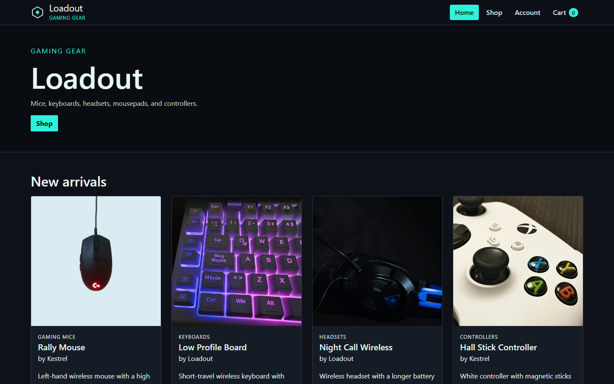
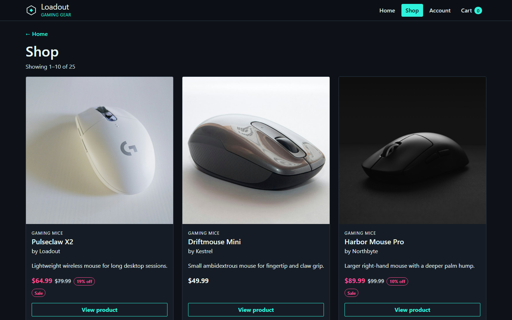
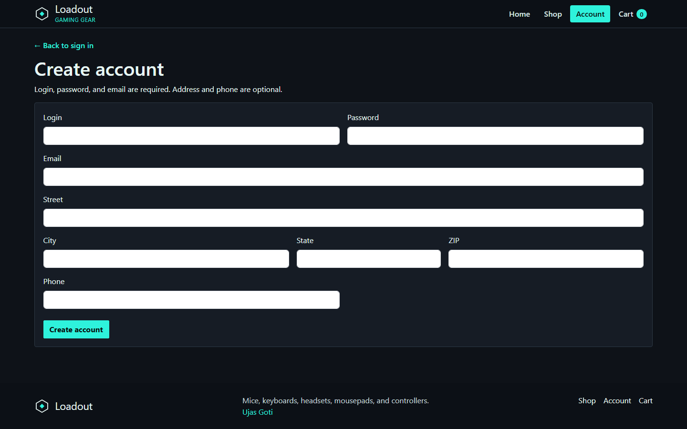
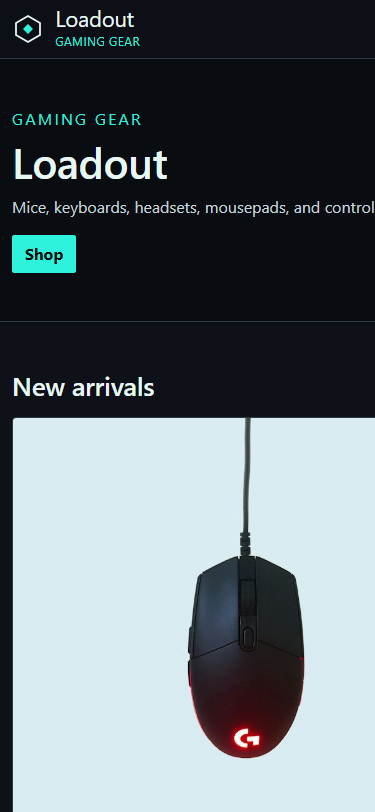
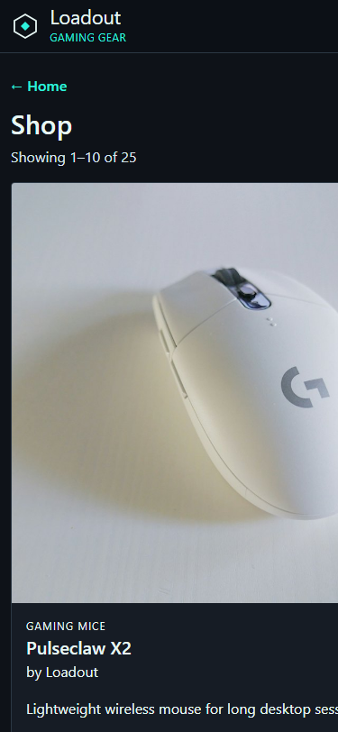
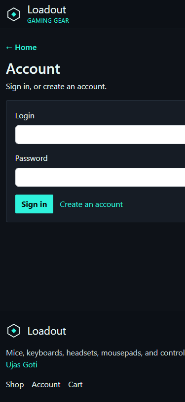
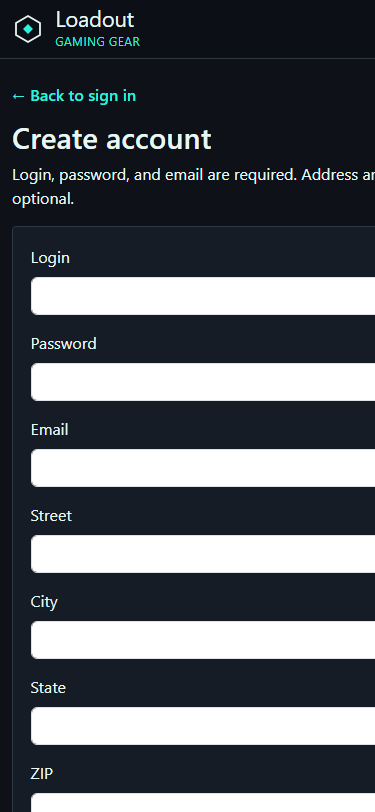

# Mobile ready demo

The store is a Bootstrap 5 layout. I did not write a second mobile stylesheet from scratch. I used Bootstrap's grid, spacing utilities, and the responsive navbar, then added a small amount of custom CSS for the dark theme and the cart row.

**How I took these screenshots:** Chrome/Edge window at about **1440×900** for desktop, and **375×812** (iPhone-size) for mobile. You can repeat this with DevTools → Toggle device toolbar.

## Desktop (large resolution)

Home at 1440px. The navbar shows Home, Shop, Account, and Cart in one row. New arrivals uses four columns (`col-lg-3`).



Shop at 1440px. Product cards sit in three columns (`col-lg-4`). Pagination sits under the grid.



Create account at 1440px. The form uses `row` + `col-md-6` / `col-md-5` / `col-md-3` / `col-md-4` so login/password sit side by side and city/state/ZIP share one row.



## Mobile (low resolution)

Home at 375px. The navbar collapses. The hamburger (`navbar-toggler`) opens Home / Shop / Account / Cart as a vertical list. The hero copy and the Shop button stay readable. New arrivals stacks to one card per row (`col-12`).



Shop at 375px. One product card per row. The "← Home" link stays above the heading. Page buttons remain usable at the bottom of the list.



Account and Create account at 375px. Inputs go full width. Labels stay above the fields. Footer links wrap instead of overflowing.





## What Bootstrap is doing

| Feature | Bootstrap piece | Why it matters here |
| --- | --- | --- |
| Page width | `container` | Centers content and adds padding on small screens |
| Product grid | `row` + `col-12 col-sm-6 col-lg-4` (shop) and `col-lg-3` (new arrivals) | 1 column on phones, 2 on tablets, 3–4 on desktops |
| Navbar | `navbar navbar-expand-lg navbar-dark` + `navbar-toggler` + `collapse` | Links sit in a row from `lg` (992px) up; below that they hide behind the menu button |
| Forms | `form-control`, `form-select`, `form-label`, `is-invalid`, `invalid-feedback` | Inputs stretch to the column width; error text stays under the field |
| Pagination | `pagination` / `page-link` | Shop pages stay tappable on a phone |
| Footer | `d-flex flex-column flex-md-row` | Stacks on mobile, sits in a row on desktop |

Bootstrap JS (`bootstrap.bundle.min.js` in `main.jsx`) runs the collapse for the hamburger. `data-bs-toggle="collapse"` and `data-bs-target="#mainNav"` are the only hooks I needed.

## Custom CSS I added for small screens

In `src/styles/store.css`:

```css
@media (max-width: 991.98px) {
  .navbar.site-nav .navbar-nav {
    flex-direction: column;
    align-items: stretch;
  }
  .navbar.site-nav .navbar-nav .nav-link {
    width: 100%;
    text-align: left;
  }
}

@media (min-width: 768px) {
  .cart-item {
    grid-template-columns: 96px 1.4fr 140px 120px;
  }
}
```

Below 768px a cart line is a two-column grid (photo + details). From 768px up it becomes four columns (photo, details, quantity, price/remove) so the plus/minus buttons do not sit on top of the name.

Hero type uses `clamp()` so the "Loadout" heading shrinks on a phone without a separate font-size breakpoint.

## What I checked at the low resolution

- Nav is not a horizontal row that overflows
- Product images keep a square `aspect-ratio` and do not stretch the card
- Form fields do not overflow the card
- Back links (`← Home`, `← Back to shop`) stay visible so you are not stuck
- Footer name and links wrap
