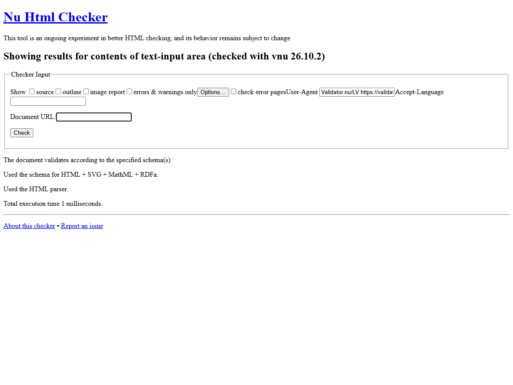
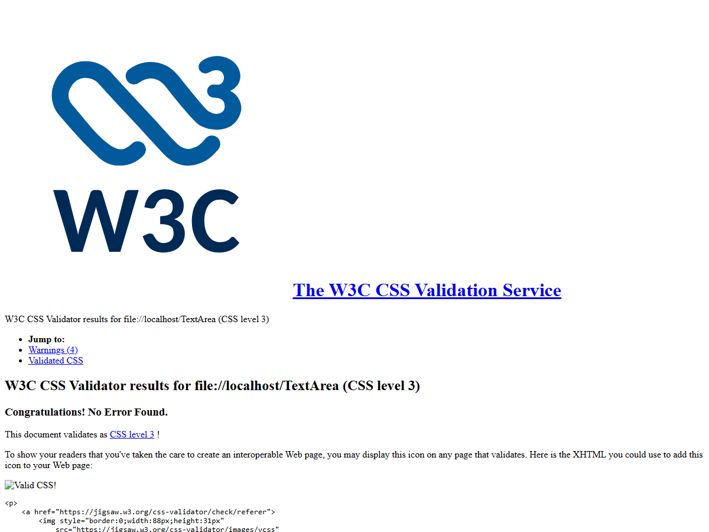

# Validation

I validated the HTML and the CSS I wrote with the W3C services that W3Schools wraps:

- HTML: [W3C Markup Validation Service (Nu Html Checker)](https://validator.w3.org/nu/)
- CSS: [W3C CSS Validation Service](https://jigsaw.w3.org/css-validator/)
- W3Schools front ends: [HTML validator](https://www.w3schools.com/html/html_validate.asp), [CSS validator](https://www.w3schools.com/css/css_validator.asp)

I validated `index.html` and `src/styles/store.css`. I did **not** paste Bootstrap's `bootstrap.min.css` into the validator. That file is third-party, it is full of vendor prefixes, and I did not edit it.

## HTML result: 0 errors, 0 warnings

I posted `index.html` to `https://validator.w3.org/nu/?out=json`. The checker returned:

```json
{"version":"26.10.2","messages":[]}
```

An empty `messages` array means the document is valid HTML5.

**What I fixed before it passed.** The Vite starter used trailing slashes on void tags (`<meta charset="UTF-8" />`). The checker reported those as info messages ("Trailing slash on void elements has no effect…"). I removed the slashes so the file matches HTML5 void-element style:

```html
<meta charset="UTF-8">
<link rel="icon" type="image/svg+xml" href="/favicon.svg">
<meta name="viewport" content="width=device-width, initial-scale=1.0">
```

The page already had `<!doctype html>`, `lang="en"`, a charset, a viewport tag, and one `h1` title.



The screenshot is the Nu Html Checker output: "The document validates according to the specified schema(s)."

## CSS result: 0 errors

I ran `src/styles/store.css` through the W3C CSS validator with profile **CSS level 3**.

```
Congratulations! No Error Found.
This document validates as CSS level 3 !
Warnings (4)
```



**Errors I fixed.** The first run had three vendor-extension warnings that I treated as problems because they are not standard CSS:

- `-webkit-box`
- `-webkit-line-clamp`
- `-webkit-box-orient`

Those were on `.card-description` to clamp shop-card text to three lines. I replaced them with normal CSS so the file validates as CSS3:

```css
.card-description {
  overflow: hidden;
  max-height: 4.8em;
  line-height: 1.6;
}
```

After that change the vendor warnings were gone.

## The 4 remaining CSS warnings (not errors)

The validator still reports the same warning four times:

- `.btn-accent:hover` — same color for `background-color` and `border-color`
- `.btn-accent:disabled` — same color for `background-color` and `border-color`
- `.pagination .page-item.active .page-link` — same color for `background-color` and `border-color`

These are **warnings, not errors**. The file still "validates as CSS level 3." I left them on purpose. The Shop button, the Add to cart button, and the active page number are solid cyan pills. The fill and the border are the same color (`#2ef2dc` or `#7dfff2` on hover) so there is no outline ring. Changing the border to a second color would make the buttons look outlined, which is not the design.

I did not get any parse errors, unknown properties, or missing braces.

## After Google Cloud hosting

When the static site is live, re-check the public URL in the same two validators and replace these screenshots if the TA wants the live URL on the report. Hash routing does not change the HTML document the checker sees (`index.html` is still the only HTML file).
